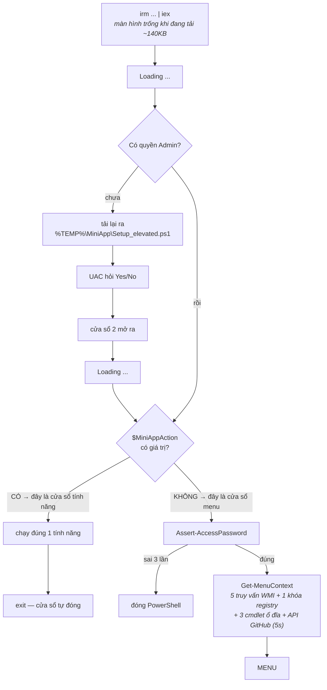
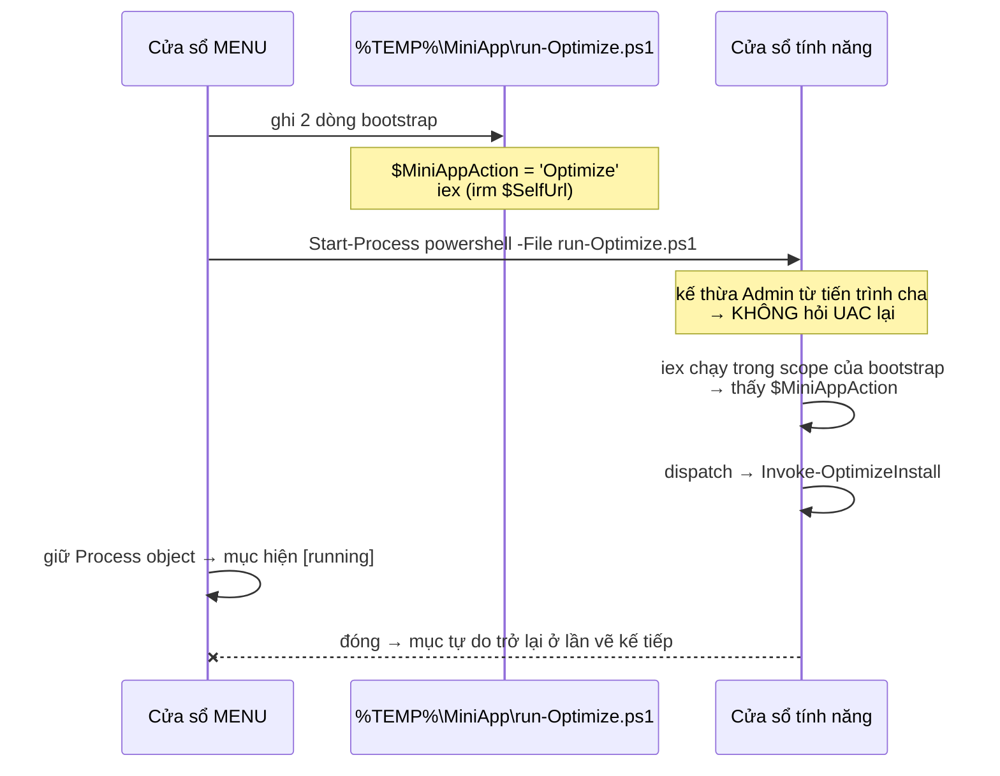
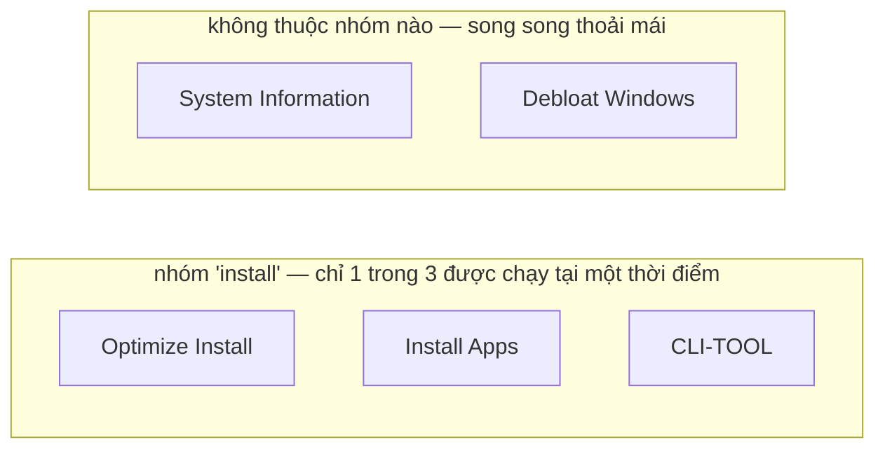
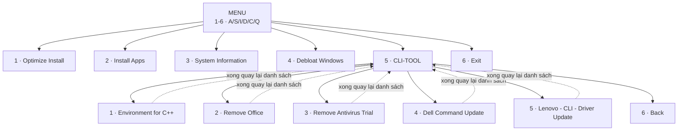
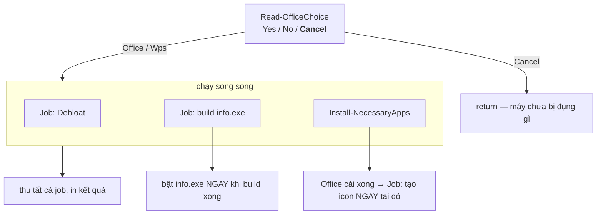
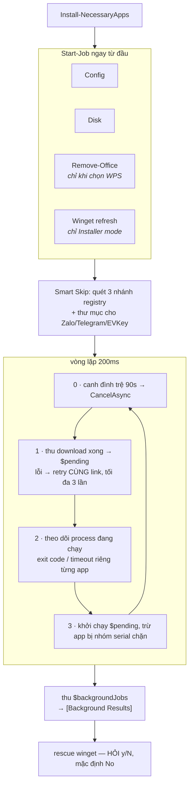
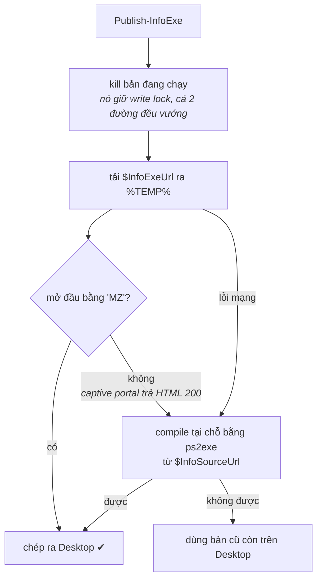
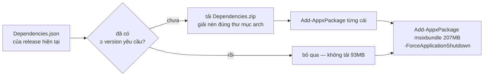

# Workflow — MiniApps Windows Setup

Sơ đồ luồng hoạt động của `Setup.ps1`. Tài liệu này mô tả **code hiện tại**; nếu sửa code mà
không sửa file này thì nó thành sai — mọi con số và tên hàm ở đây đều đọc ra từ `Setup.ps1`.

---

## 1. Cấu trúc dự án

```
scr-miniaz/
├── Setup.ps1              ← file triển khai DUY NHẤT, tự chứa toàn bộ logic
├── info-app/
│   ├── Info.ps1           ← bản gốc (canonical) của cửa sổ System Information
│   ├── Build-InfoExe.ps1  ← build tay để xem thử trên máy dev, không dùng lúc chạy thật
│   └── README.md
├── config/                ← bản độc lập cho WinRAR SFX. Setup.ps1 KHÔNG gọi tới
│   ├── Config.ps1  disk.ps1  Get-info.ps1  Remove-Office.ps1
│   └── OfficeRemoval/     ← Office Tool Plus + purge.xml / upgrade.xml
├── url.md                 ← danh sách Direct Link nguồn (Cloudflare R2)
├── workflow.md            ← file này
├── README.md              ⚠ đang lệch với code
└── ARCHITECTURE.md        ⚠ đang lệch với code
```

**Ba nguồn tài nguyên ngoài**, khai báo một chỗ duy nhất ở đầu `Setup.ps1`:

| Biến | Trỏ tới | Dùng làm gì |
|---|---|---|
| `$SelfUrl` | `raw.githubusercontent.com/.../Setup.ps1` | tự leo quyền, và **cửa sổ tính năng nạp lại chính nó** |
| `$InfoExeUrl` | `pub-....r2.dev/info.exe` | bản `info.exe` dựng sẵn |
| `$InfoSourceUrl` | `raw.githubusercontent.com/.../info-app/Info.ps1` | nguồn để compile khi R2 chết |
| `$R2` | `pub-....r2.dev` | 11 gói cài trong `$AppCatalog` |

> ⚠ Sửa `info-app/Info.ps1` thì **phải build lại và upload đè lên R2**. Nhánh compile tại chỗ
> (vốn luôn lấy bản mới nhất từ GitHub) giờ chỉ chạy khi R2 không với tới được.

---

## 2. Khởi động



Ba điểm dễ hiểu nhầm:

1. **Chạy từ RAM thì script không đọc được source của chính nó.** `$MyInvocation...ScriptContents`
   rỗng, nên leo quyền **buộc phải tải lại** từ `$SelfUrl`. Đây là gốc rễ của cả cơ chế cửa sổ
   tính năng ở mục 3.
2. **Cửa sổ 1 không bao giờ hiện menu.** Nó leo quyền rồi `exit`.
3. **Đoạn chờ dài nhất nằm ở `Get-MenuContext`**, sau chữ `Loading ...` và không có báo hiệu gì thêm.

---

## 3. Cửa sổ tính năng — cơ chế cốt lõi

Mỗi mục menu mở **một process PowerShell riêng**, menu ở lại dùng được.



**Vì sao phải qua file bootstrap** — cửa sổ con không nhận được source từ cửa sổ cha (lý do ở mục
2.1), nên cách duy nhất là bảo nó tự tải lại kèm một biến báo "chạy thẳng mục này".

**Cổng mật khẩu nằm *dưới* khối dispatch**, nên cửa sổ tính năng `return` trước khi tới đó —
hỏi một lần cho cả phiên, không phải mỗi cửa sổ một lần.

### Khóa chống chạy chồng



- Mục đang mở cửa sổ của chính nó → `[running]`, bấm lại bị từ chối
- Mục bị anh em cùng nhóm giữ → `[blocked]`, báo rõ **tên cửa sổ đang giữ nó**
- `System Information` và `Debloat` không thuộc nhóm nào, chạy song song thoải mái

> **Hạn chế đã biết:** khóa ở mức *cửa sổ*, không ở mức *tool*. Tiến trình menu không nhìn thấy
> được bên trong tiến trình con đang chạy tool nào, nên không có gì mịn hơn để khóa.

---

## 4. Bản đồ menu



`Update Winget` **đã ẩn** khỏi CLI-TOOL — engine cài đặt tự làm việc đó ở nền (mục 6). Hàm và
`case` vẫn còn, hiện lại chỉ cần chép lại một dòng đã ghi sẵn trong comment trên `$CliTools`.

`Lenovo - CLI - Driver Update` làm theo đặc tả [docs/Lenovo-Global-driver.md](docs/Lenovo-Global-driver.md),
dùng module `Lenovo.Client.Update` (LCU).

> **Một quy tắc của spec đã bị ghi đè, có chủ đích.** Spec giao LCU cho quản trị viên cấp phát
> trước từ nguồn đã duyệt và cấm tool tự tải. Quy tắc đó viết cho triển khai doanh nghiệp có
> governance; đây là tool bench setup từng máy, không ai stage sẵn gì cả, và cái "stop" đó chỉ tạo
> ra ngõ cụt. Nên **thiếu LCU thì tự cài từ PSGallery**. Đây không phải mức rủi ro mới — file này
> vốn đã lấy `ps2exe` từ PSGallery.

Những gì **không** nới, vì không phụ thuộc vào nguồn cấp phát:

| Giữ nguyên | Vì sao |
|---|---|
| `-SkipSignature` / `-SkipSignatureCheck` | không truyền, ở bất kỳ cmdlet nào — xác minh chữ ký luôn bật |
| Không `Set-PSRepository ... Trusted` | `Install-Module -Force` qua được lời nhắc cho **riêng lần gọi này**, thay vì đổi một thiết lập toàn máy sống lâu hơn cả lượt chạy |
| Ép `-Model` | không dùng — đó chính là cách máy China SKU nhận nhầm package Global |

Luồng: preflight (Lenovo commercial → Win10/11 + PS5+ → elevated → reboot pending → LCU import
được → đủ dung lượng cache) → `Get-LnvUpdate -LogPath` (**không** `-All`: mặc định đã chỉ trả
package cần và phù hợp) → lọc → báo cáo → xác nhận → `Save-LnvUpdate` → `Install-LnvUpdate
-ExportToWMI`.

**Lọc phải xong trước khi tải bất cứ gì**, hai tầng: `Category` phải là `Driver`, **và**
`Installer.Unattended` phải đúng — installer tương tác sẽ đứng chờ một cú bấm không ai đưa và treo
cả lượt chạy. BIOS/firmware/application bị đẩy sang mục *Skipped* dù chúng đến từ cùng một lượt quét.

Hai chỗ đáng chú ý:

- **`ShouldProcess` là thật, không phải trang trí.** Phần đụng vào máy tách hẳn thành
  `Install-LenovoDriverPackage` mang `[CmdletBinding(SupportsShouldProcess, ConfirmImpact='High')]`,
  nên `Save-LnvUpdate` và `Install-LnvUpdate` **nằm bên trong** cửa kiểm. Gắn attribute lên một hàm
  đã trót gọi module rồi thì chẳng bảo vệ được gì. Không có `-Force` tự chế.
- **`Category` hay `Type`?** Tài liệu Lenovo dùng cả hai, và spec cấm hard-code theo một ví dụ. Code
  đọc `Category` trước rồi `Type`, và **in ra trường nào thực sự mang giá trị** để đối chiếu với
  phiên bản LCU đã duyệt thay vì tin suông.

Kết quả in theo từng package (`PackageID`, `Status`, `ExitCode`, `ActionNeeded`, `Message`,
`Duration`) và quy về 4 trạng thái: `SUCCESS` / `SUCCESS - ACTION NEEDED` / `NOT PERFORMED` /
`FAILED`. Không bao giờ `Restart-Computer`; chỉ **đề xuất** quét lại, vì một driver có thể làm
driver khác mới trở nên applicable.

`Dell Command Update` chạy 5 bước, không bước nào bỏ được:

1. **Tiền kiểm** — Dell, Administrator, và **reboot pending** (đọc 3 nguồn: `Component Based
   Servicing\RebootPending`, `WindowsUpdate\Auto Update\RebootRequired`,
   `PendingFileRenameOperations`). Kiểm reboot trước vì `dcu-cli` từ chối apply khi đang treo một
   lần khởi động lại — nó trả mã `5`, nhưng chỉ sau khi đã chạy hết scan.
2. **.NET Desktop Runtime ≥ 10.0.8** — DCU là ứng dụng WPF; **thiếu runtime thì installer của nó
   dừng giữa chừng và không để lại gì**. Nên đây là điều kiện tiên quyết, phải xong **trước** khi
   đụng tới DCU. Dò bằng cách đọc thư mục
   `%ProgramFiles%\dotnet\shared\Microsoft.WindowsDesktop.App` chứ không hỏi
   `dotnet --list-runtimes` — lệnh đó cần dotnet host nằm trên PATH, mà máy chỉ có runtime (không
   có SDK) thường không có, và sẽ báo "thiếu" trên một máy vốn đủ. Cài lại vẫn không đạt ngưỡng
   thì **dừng hẳn**, không thử cài DCU nữa.
3. **Cài DCU nếu thiếu** — winget được chuẩn bị **một lần**, và chỉ khi thực sự có thứ cần tải:
   máy đã đủ cả hai điều kiện thì không phải trả giá một lần kiểm version, nói gì tới 207MB. Dùng
   chung `Test-WingetIsCurrent` với job nền của engine, một hàm duy nhất nên hai chỗ không lệch.
4. **Scan + xuất file** — `/scan -updateType=driver -silent -report=<dir> -outputLog=<file>`,
   ghi vào `%TEMP%\MiniApp\DCU\`. Report cũ bị xóa trước, không thì nó bị đọc nhầm thành kết quả
   của lượt này.
5. **Đọc XML, in ra, rồi mới hỏi** — `DCUApplicableUpdates.xml` có gốc `updates` chứa các `update`
   mang `type` / `name` / `version` / `Urgency`. Chỉ sau khi anh xác nhận mới chạy
   `/applyUpdates -updateType=driver -silent -reboot=disable -outputLog=<file>`.

Cố ý **không** truyền `-forceUpdate` — nó cài lại cả driver đang mới, mất thời gian mà không được
gì. Đổi `-updateType=driver` ở **cả hai** lệnh thành `driver,bios,firmware` là mở rộng sang BIOS.

> **Hai chỗ dễ sai mà code đã chặn.** Report **không đọc được** ≠ **không có update** — gọi máy là
> "đã mới nhất" khi thực ra không đọc nổi báo cáo là nói dối, nên nhánh đó báo lỗi và không apply
> gì. Và `@($doc.updates.update)` trên một report rỗng cho ra mảng **1 phần tử `$null`** (bẫy kinh
> điển của PowerShell), nên phải lọc `Where-Object { $_ }` — thiếu nó thì report rỗng báo
> "1 update found" rồi in một dòng trắng.

Mã thoát của `dcu-cli` phải đọc mới phân biệt được, vì `0`, `1`, `5` và `500` **đều để máy nguyên
trạng**:

| Mã | Nghĩa |
|---|---|
| `0` | xong |
| `1` | xong, **cần khởi động lại** |
| `5` | đã có yêu cầu khởi động lại từ trước |
| `500` | không tìm thấy update — driver đã mới nhất |
| `2` | lỗi ứng dụng |

Chỉ chạy trên máy Dell (`Win32_ComputerSystem.Manufacturer`), và **in ra tên hãng** khi từ chối để
một chuỗi OEM lạ nhìn ra được chứ không giống lỗi.

`Remove Antivirus Trial` gỡ McAfee/Norton cài sẵn theo máy mới. Nó **quét trước, in ra danh
sách tìm được, rồi mới hỏi** — vì `McAfee` và `Norton` là pattern rộng, và người đọc được đúng tên
sẽ khớp trước khi trả lời thì không thể bị bất ngờ. Ba đường gỡ, xếp theo mức tin cậy:

| Nguồn lệnh | Cách chạy |
|---|---|
| `QuietUninstallString` | dùng **nguyên văn** — hãng tự công bố nên nó im lặng theo thiết kế |
| `MsiExec /I{GUID}` | viết lại thành `/X{GUID} /qn /norestart` — switch của nền MSI, không phải của hãng |
| còn lại | **không đoán switch**, chạy hiện cửa sổ để kỹ thuật viên bấm tay |

Đường thứ ba là có chủ đích: `UninstallString` của Norton là `InstStub.exe /X /ARP`, và Norton
**không công bố** switch im lặng nào. Đoán bừa `/S` là chấp nhận rủi ro âm thầm làm sai trên một
bản quyền khách đã trả tiền. Bản Store app (`McAfee Personal Security`) được gỡ riêng bằng
`Remove-AppxPackage -AllUsers` **và** `Remove-AppxProvisionedPackage` — thiếu bước thứ hai thì tài
khoản mới tạo sẽ được cài lại lúc đăng nhập lần đầu.

`Remove Office` chạy đúng `$RemoveOfficeScript` mà job WPS dùng, nhưng qua `Invoke-RemoveOffice`
— bản foreground có thêm **một câu hỏi `[y/N]`**. Đường job lấy sự đồng ý từ câu hỏi bản quyền
(trả lời "không có bản quyền" chính là thứ kích hoạt nó); vào từ danh sách tool thì không có câu
trả lời nào đứng sau, nên phải hỏi. Bản thân scriptblock quét trước và thoát nếu máy không có
Office, nên bấm nhầm `y` trên máy sạch cũng không mất gì.

---

## 5. Mục 1 — Optimize Install



**Cancel là chốt hủy duy nhất.** Nó phải nằm *trước* `Start-Job` của Debloat — nếu để rơi xuống
tận `Install-NecessaryApps` thì máy đã bị debloat mất rồi.

**Vì sao icon Office không chạy song song được:** `New-DesktopShortcuts` dò
`Test-Path "C:\Program Files\...\WINWORD.EXE"`. Chạy sớm thì Office còn đang cài, `Test-Path` false,
tạo 0 icon và **không báo gì cả**. Nên nó được bắn đúng nhịp engine thấy ô Office chuyển `Done`.

---

## 6. Engine cài đặt



### Job nền và thứ tự

| Job | Bắt đầu | Nhãn output |
|---|---|---|
| Config | đầu lượt | `[Config]` |
| Disk | đầu lượt | `[Disk]` |
| Remove-Office | đầu lượt, chỉ khi chọn WPS | `[Office]` |
| **Winget refresh** | đầu lượt, chỉ Installer mode | `[Winget]` |
| **Icon Office** | ngay khi ô Office chuyển `Done` | `[Icons]` |
| Debloat | do `Invoke-OptimizeInstall` khởi động | `[Debloat]` |
| build info.exe | do `Invoke-OptimizeInstall` khởi động | — (trả về đường dẫn) |

> **Vì sao Winget refresh phải nằm trong `$backgroundJobs`:** nhóm job này được thu **trước**
> nhánh rescue winget ở cuối hàm. Đặt đúng chỗ thì rescue không bao giờ bắn qua một App Installer
> đang bị thay thế dở dang — không cần thêm cờ đồng bộ nào.
>
> Job này **hỏi tag release rồi so version trước khi tải bất cứ gì**. Máy đã current thì báo
> `SKIPPED` và không tốn 207MB chồng lên ~400MB app đang tải.

### Nhóm serial

`VCRedist x64` và `x86` cùng nhóm `vcredist` — cả hai là Burn bundle bọc MSI, tranh mutex
`_MSIExecute` nên chạy cùng lúc là lỗi 1618. Chúng vẫn song song với mọi app khác.

---

## 7. `info.exe` — hai đường



Tải về `%TEMP%` rồi **kiểm xong mới chép** ra Desktop — tải đứt giữa chừng mà ghi thẳng là đè mất
bản đang chạy tốt bằng một file cụt.

---

## 8. Winget — vì sao không dùng `Repair-WinGetPackageManager`

`Install-WingetDependencies` đọc `DesktopAppInstaller_Dependencies.json` **của chính release đó**
lúc chạy, thay vì ghim URL trong code.



Ghim cứng đã mục rữa **hai lần**:

| Ghim trong code cũ | Thực tế |
|---|---|
| `Microsoft.UI.Xaml 2.8.6` | App Installer bỏ hẳn UI.Xaml từ 1.12.350 (WinUI 2 → WinUI 3), thay bằng `Microsoft.WindowsAppRuntime` |
| `aka.ms/...VCLibs...Desktop.appx` → `14.0.33321.0` | release yêu cầu `14.0.33728.0` — **cũ hơn yêu cầu** |

Cả hai `Add-AppxPackage` cũ đều có `-ErrorAction SilentlyContinue`, nên máy hỏng vẫn chạy hết hàm
và **trông như thành công**.

`Repair-WinGetPackageManager` bị loại vì [winget-cli #5559](https://github.com/microsoft/winget-cli/issues/5559)
và [#5772](https://github.com/microsoft/winget-cli/issues/5772) — cả hai **còn mở**, cả hai chết ở
*đúng bước dependency này*, và #5772 ghi "chạy được máy này, không được máy kia". Nó không ổn định
hơn, chỉ giấu cùng điểm gãy sau một cmdlet và trả về mã thô như `0x80073CF9`.

---

## 9. Các nút vặn

| Biến | Giá trị | Ý nghĩa |
|---|---|---|
| `$Script:MaxDlTries` | 3 | số lần thử lại **cùng một link**, backoff 0s→2s→4s |
| `$Script:DlStallSec` | 90 | đứng yên bao lâu thì coi là treo (`WebClient` không có timeout) |
| `$Script:JobTimeoutSec` | 3600 | trần cho mọi job nền |
| `$Script:UiWidth` | 76 | bề rộng khung — bảng tiến trình dùng chung |
| `$Script:MaxPasswordTries` | 3 | sai đủ số này thì đóng PowerShell |
| `$Script:AccessPassword` | `@z` | biển "nhân viên only", **không phải khóa** — plaintext trong file public |

---

## 10. Mở rộng

**Thêm app:** một dòng trong `$AppCatalog`
```powershell
@{ Name = "Tên"; Url = "..."; WingetId = "..."; Args = "/S"; MatchName = "Regex"; TimeoutSec = 300 }
```
`Name` ≤ 13 ký tự cho vừa bảng tiến trình. Bỏ trống `MatchName` → luôn cài, không Smart Skip.

**Thêm CLI tool:** một dòng trong `$CliTools` + một `case` trong `Invoke-CliTools`. Đánh số, slot
`Back` và cuộn vòng mũi tên **tự co giãn theo bảng** — phím số được đọc ra rồi đối chiếu chứ không
liệt kê từng `case`, nên tool mới không cướp phím của `Back`.

**Thêm mục menu:** `$MenuOptions` + `case` trong dispatch + phím trong `Read-MenuChoice`
+ (nếu cần) `$ExclusiveGroups`. ⚠ Chèn vào giữa là **mọi phím số phía sau dịch hết** — đây là chỗ
đã suýt sai khi thêm CLI-TOOL.

**Thêm cặp loại trừ:** hai dòng trong `$ExclusiveGroups`, cùng tên nhóm.

**Thêm nhóm serial:** hai dòng trong `$SerialGroups`, cùng tên nhóm.
